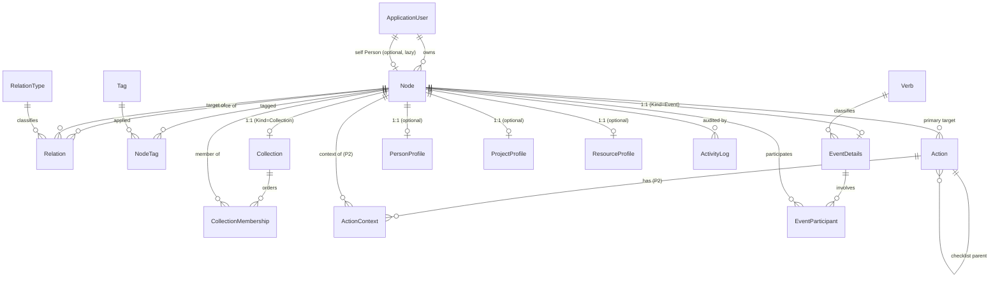

# Nook Knowledge-Graph Redesign

> Design date: 2026-07-02 (revised). Architecture, product modeling, and sequencing only. Companion document: `docs/Knowledge-Graph-Migration-Plan.md`.
>
> **Implemented 2026-07-02** — see `docs/Knowledge-Graph-Implementation-Report.md`. The core redesign (Phase 0 + 1 + 2) shipped as one cohesive delivery. Material differences from this plan: the product "Action" is the C# entity **`ActionItem`** (avoids `System.Action`); **Events, ActionContext and checklists were built now** (not deferred to a later phase); and there is **no new→legacy projection** — legacy `Item*` tables are an immutable rollback snapshot and post-cutover rollback is a database restore (see report §8).

## Executive Summary

Nook is moving from one overloaded `Item` table (behavior driven by an `ItemType` enum) to a **hybrid, Node-centered relational model** on plain SQL Server. Everything addressable — a note, a person, a project, a place, a bookmark, a collection, an event — is a **Node**. The Node table holds only fields common to most things (owner, title, optional body, optional url, kind, lifecycle state, pin/favorite, timestamps). Everything richer lives in purpose-built tables that reference a Node through a **real foreign key**: typed **Relations**, **Collections** (folders/lists/queues), **Actions** (tasks/reminders/checklists), **Events** (verb logs), **Tags**, and optional 1:1 **profile** satellites for entity-specific fields.

This revision locks several refinements on top of the directionally-approved design:

1. **Standalone, progressively-organized Nodes.** A Node is valid with only `UserId`, `Title`, `CreatedAt`, `UpdatedAt`, and `Kind = Unclassified`. It needs no tag, relation, collection, action, or event. It can stay unclassified forever or be **promoted** later (to Note, Person, Project, Event, Collection, …) **without changing its Node identity** — tags, links, actions, memberships, timestamps, and history all carry over.
2. **System views vs. stored data.** `All`, `Unassigned`, and `Inbox` are *generated views/filters*, not stored collections. A small explicit lifecycle — **Inbox → Active → Archived** — lives on the Node.
3. **Node-backed Collections and Events.** Collections and Events are no longer side tables floating outside the graph; each has a **required 1:1 Node identity**, so they can be tagged, related, searched, pinned, archived, and back-linked like anything else.
4. **Shared Action model with reusable-intent semantics.** Tasks, reminders, and checklist items are one `Action` table. A Node captures reusable knowledge ("Have Jamie pick me up before X"); Actions are the dated, completable **instances** of work spun off from it. Completing an Action never marks its source Node done.
5. **Phase 1 now includes a minimal `Action` table** and a lossless Todo/Reminder backfill, so no legacy task/reminder state is left in limbo.
6. **One authoritative write model** after cutover — no uncontrolled dual writes between old and new pages.

`NodeKind` is a lightweight classification for display, filtering, and choosing an optional profile — **not** a source of behavior. Behavior comes from the related tables. Per-user scoping (`UserId` + `DeleteBehavior.Restrict`) is preserved on every table.

**Phase 1** delivers: the Node core (with lifecycle + `Unclassified`), typed Relations, Node-backed Collections, a minimal Action table (Task/Reminder), a redesigned Node detail page with a Connections/Backlinks panel and Create-Action, and a lossless migration. Events UI, checklists, queue planning, and `ActionContext` land in Phase 2; graph visualization and recurrence in Phase 3.

---

## 1. Current-State Assessment

### 1.1 How it works today (confirmed from the code)

| Concept | Implementation | Notes |
|---|---|---|
| **Item** | `Models/Item.cs` — one table; `ItemType`/`ItemStatus`/`Priority` string enums. Columns: Title, Body, Url, DueDate, ReminderDate, CompletedDate, ParentItemId, IsPinned, IsFavorite, ArchivedAt, CreatedAt/UpdatedAt. | Timestamps auto-stamped in `NookContext.SaveChanges`; `IsArchived` is `[NotMapped]`. |
| **ItemType** | Enum: Note, Reminder, Bookmark, Thought, List, Todo, Idea, Reference. | Drives page filters and per-type behavior. |
| **ItemLink** | Directional (Source→Target), optional free-text `LinkType`, unique `(Source,Target)`, both FKs `Restrict`. | Powers the "Linked items" panel; `LinkType` unused in UI. |
| **ParentItemId** | Self-reference, `Restrict`. | Single-parent tree ("Sub-items"). |
| **Tags** | `Tag` (per-user, unique `(UserId,Name)`, Color) + `ItemTag` join (composite PK, cascade both). | `TagService` scopes by user. |
| **Reminders / Todos / Bookmarks** | Items filtered by `ItemType`/date fields; complete/reopen toggles `Status`+`CompletedDate`. | Reminders are a filtered view; no notification job. |
| **ActivityLog** | Append-only audit: UserId, nullable ItemId, denormalized ItemTitle, `ActivityType`, Timestamp, Detail. | Survives item deletion. |
| **Timeline / Analytics** | `TimelineService` reads last **500** audit rows, groups by day, weekly shoutouts. `AnalyticsService` loads all user items in memory and computes stats. | Nothing stored; recomputed on demand. |
| **Scoping** | Every service resolves `ICurrentUser` and filters by `UserId`; all user FKs `Restrict` (multi-cascade-path avoidance). | Convention to carry into every new table. |

### 1.2 Retained largely unchanged
Identity/auth/scoping; the `Tag` table and per-user uniqueness (join retargets Item→Node); `ActivityLog` as audit (retarget `ItemId`→`NodeId`); the `IDbContextFactory` short-lived-context service pattern; recomputed Timeline/Analytics; and the **fast-capture ethos**.

### 1.3 Too coupled to `ItemType`
Per-type branching in services/pages; action state (`Status/Priority/DueDate/ReminderDate/CompletedDate`) living on the knowledge row; `LinkType` as untyped free text; single-parent hierarchy that can't express multi-membership.

### 1.4 UI/services to redesign vs keep
Redesign: `ItemDetail`→`NodeDetail`; `Items`/`ItemFilterBar`; `Todos`/`Reminders` (become Action-driven); split `ItemService` into `NodeService`/`RelationService`/`CollectionService`/`ActionService`(+`EventService` P2). Light rework: `Bookmarks`. Mostly unchanged: `Tags`/`TagChips`/`TagAutocomplete`, auth pages, `DbSeeder` plumbing. Rewire: `Dashboard`/`Analytics`/`Timeline`/`Log`.

### 1.5 Confirmed vs assumption
**Confirmed:** everything in §1.1, the `Restrict` convention, the 500-event cap, `LinkType` being free text, single-parent hierarchy. **Assumptions:** most rows are Notes with few links; `LinkType` rarely populated; List-type items lightly used. These affect migration effort, not correctness — the migration is lossless regardless.

---

## 2. Recommended Core Domain Model

### 2.1 Decision: one Node core + specialized supporting tables (hybrid)
Separate per-concept tables would force every relation/tag/collection/action/event into a polymorphic `(TargetType, TargetId)` pair that **SQL Server cannot enforce with a real FK** — losing integrity and simple joins. A single Node table gives one real FK target for everything; kind-specific structured fields live in optional **1:1 profile** tables so Node never grows unused columns and no EAV is introduced. **This hybrid is locked.**

### 2.2 Updated ERD (Mermaid)

### 2.3 Node kinds and lifecycle

**`NodeKind`** (string enum, default **`Unclassified`**):
- **Unclassified** — the quick-capture default; a valid, first-class Node.
- **Record kinds:** Note, Journal, Observation, Idea, Reference, Bookmark, List *(legacy content list; distinct from a Collection)*.
- **Entity kinds:** Person, Project, Place, Organization, Topic, Resource *(book/movie/article/product/tool — subtype in `ResourceProfile.ResourceType`)*.
- **Structural kinds:** Collection *(sub-typed by `Collection.CollectionKind` = Folder | List | Queue | Plain)*, Event.

**`NodeState`** (string enum) — the explicit lifecycle:
- **Inbox** — captured, not yet intentionally organized. **Fully valid, searchable, and visible**; not hidden or incomplete.
- **Active** — intentionally kept/organized.
- **Archived** — removed from default daily views without deleting history; sets `ArchivedAt`.

Quick captures default to **`Inbox`**; migrated legacy items become **`Active`** (they were already in use).

### 2.4 Table-by-table recommendation
**Phase key:** **P1** = Phase 1, **P2** = Phase 2, **Opt** = when-needed.

#### Node — the addressable thing (P1)
- **Columns:** `NodeId` (PK int identity — reuses existing Item IDs on migration), `UserId` (FK Restrict), `Kind` (string, default `Unclassified`), `State` (string: Inbox|Active|Archived, default Inbox), `Title` (nvarchar(300), required), `Body` (nvarchar(max), null), `Url` (nvarchar(1000), null), `IsPinned` (bit), `IsFavorite` (bit), `ArchivedAt` (datetime2 null), `CreatedAt`, `UpdatedAt`.
- **Minimum valid row:** `UserId` + `Title` + `CreatedAt` + `UpdatedAt` + `Kind=Unclassified` + `State=Inbox`. Nothing else required.
- **Scoping/indexes:** `UserId` Restrict + indexed; `(UserId, State)`, `(UserId, Kind)`, `(UserId, UpdatedAt)`, filtered `(UserId) WHERE IsPinned = 1`.
- **Not here:** Status/Priority/DueDate/ReminderDate/CompletedDate — those belong to `Action`.

#### RelationType — typed vocabulary (P1)
- **Columns:** `RelationTypeId` (PK), `UserId` (**nullable** — null = system seed; set = user custom), `Name`, `InverseName` (null if symmetric), `IsSymmetric` (bit), `Category`, `IsSystem` (bit).
- **SQL-Server-safe uniqueness (nullable UserId):** two **filtered unique indexes** —
  `UX_RelationType_System` on `(Name)` `WHERE UserId IS NULL`, and
  `UX_RelationType_User` on `(UserId, Name)` `WHERE UserId IS NOT NULL`.
  This avoids relying on SQL Server's single-NULL uniqueness quirk and cleanly separates system from user types.
- **Launch:** system types only (§3). Custom types are Opt/P2 (gated on a picker that prevents near-duplicates).

#### Relation — edge between two Nodes (P1; replaces ItemLink + ParentItemId)
- **Columns:** `RelationId` (PK), `UserId` (Restrict), `SourceNodeId` (FK Restrict), `TargetNodeId` (FK Restrict), `RelationTypeId` (FK), `Note` (nvarchar(500) null — context), `CreatedAt`.
- **Both FKs to Node `Restrict`** (two FKs → multi-cascade-path; app deletes relations when a node is deleted).
- **Integrity:** unique `(UserId, SourceNodeId, TargetNodeId, RelationTypeId)`; app guard `Source <> Target`; symmetric types **canonicalized** (smaller NodeId as source) so A–B and B–A collapse; service ensures both endpoints belong to the same `UserId` (no cross-user edges).
- **Indexes:** `(SourceNodeId)` (outgoing), `(TargetNodeId, RelationTypeId)` (backlinks).

#### Tag / NodeTag (P1; NodeTag replaces ItemTag)
`Tag` unchanged. `NodeTag`: composite PK `(NodeId, TagId)`, cascade from both. `UserId`-scoped through both parents.

#### Collection (1:1 profile of a Node) + CollectionMembership (P1; node-backed)
- **Collection is a required 1:1 profile of a `Node` where `Kind = Collection`.** The Node supplies title, description(=Body), tags, relations, pin/favorite/archive, search, and backlinks. This replaces the earlier "AboutNodeId-only" idea — collections connect to People/Projects/Topics via **typed Relations**, so a collection can be associated with *many* contextual Nodes.
- **Collection columns:** `NodeId` (PK + unique FK → Node, 1:1), `CollectionKind` (Folder | List | Queue | Plain), `IsOrdered` (bit), plus display prefs (e.g. `Color`, `ViewMode`).
- **CollectionMembership columns:** `CollectionNodeId` (FK → Node, Restrict), `MemberNodeId` (FK → Node, Restrict), `SortOrder` (int), `AddedAt`. **PK `(CollectionNodeId, MemberNodeId)`** → a Node can be in many collections with no duplication; ordering via `SortOrder`. `UserId`-scoped in service.
- **Semantics locked:** Collections *organize and order* Nodes. A **Queue** is an ordered Collection (`IsOrdered=true`, `CollectionKind=Queue`) for review/work sequencing ("Things to tell Jamie", "Movies to watch with Jamie", "Read later"). Collections are **not** checklists.

#### Action — tasks / reminders / checklist items (P1 minimal; P2 richer)
- **Columns (P1):** `ActionId` (PK), `UserId` (Restrict), `Kind` (Task | Reminder | ChecklistItem — ChecklistItem P2), `Status` (Open | InProgress | Done | Cancelled), `Priority` (null), `Title`, `Verb` (null — Read/Watch/Tell/Buy/Research/FollowUp), `TargetNodeId` (FK Restrict, **null** = inbox/standalone), `DueDate` (null), `RemindAt` (null), `CompletedAt` (null), `SortOrder`, `CreatedAt`, `UpdatedAt`.
- **P2 columns:** `ParentActionId` (self FK null — checklist grouping).
- **Indexes:** `(UserId, Status, DueDate)` (rollups/planning), `(TargetNodeId)` (per-node actions), `(UserId, RemindAt)` (due reminders).
- **Rule:** an Action is a **dated instance of work**; the Node is the **reusable subject**. Completing/cancelling/rescheduling an Action never changes the source Node. A Node may have zero, one, or many Actions over time.

#### ActionContext — multiple contextual associations (P2)
- **Purpose:** beyond the single primary `TargetNodeId`, associate an Action with several Nodes by role.
- **Columns:** `ActionId` (FK cascade), `NodeId` (FK Restrict), `Role` (Target | Source | Person | Project | Place | Queue | Context | Related), `UserId`. **PK `(ActionId, NodeId, Role)`.**
- **Enables:** "all open actions related to Jamie / Project X / a Queue / created-from a Node." **Phase 2** (P1 uses only `TargetNodeId`).

#### EventDetails (1:1 profile of a Node) + EventParticipant + Verb (P2; node-backed)
- **Event is a required 1:1 profile of a `Node` where `Kind = Event`.** So events are tagged, collected, related, back-linked, pinned, archived, and searched like any Node; follow-up Actions attach directly to the event Node.
- **Verb:** `VerbId`, `UserId` (nullable = system seed, filtered-index uniqueness as RelationType), `Name`, `IsSystem`.
- **EventDetails:** `NodeId` (PK + unique FK, 1:1), `VerbId` (null), `SubjectNodeId` (actor, null → self), `ObjectNodeId` (null), `PlaceNodeId` (null), `OccurredAt` (required), `Note` (null). The Node's `Title` is the free-text summary.
- **EventParticipant:** `EventNodeId` (FK cascade), `ParticipantNodeId` (FK Restrict), `Role` (Participant | Introducer | Introduced | Mentioned). PK `(EventNodeId, ParticipantNodeId, Role)`.
- **Fast capture:** `Title` (summary) + `OccurredAt` is a valid Event; everything else optional and enrichable later.

#### Profiles: PersonProfile / ProjectProfile / ResourceProfile (Opt / P2+)
1:1 with Node; add each only when its first real column is needed. Person: FullName, Nickname, Email, Phone, Birthday, HowWeMet. Project: Status, StartDate, TargetDate. Resource: ResourceType, Author, Isbn, ExternalId, Rating.

#### ActivityLog (P1; retarget only)
Keep as audit; `ItemId` → `NodeId` (nullable, denormalized title preserved). Distinct from Events (audit = system recorded a change; Event = user says something happened).

### 2.5 "Self" Person (optional, lazy)
Nullable `SelfNodeId` on `ApplicationUser`, created lazily the first time an Event needs an actor. **Not** a Phase 1 requirement.

---

## 3. Typed Relationships

### 3.1 Seed vocabulary (system types at launch)

| Name | Inverse | Symmetric? | Category | Typical use |
|---|---|---|---|---|
| related to | related to | Yes | General | generic link (ItemLink migrates here) |
| associated with | associated with | Yes | General | loose association |
| works with | works with | Yes | People | Person ↔ Person |
| contains | contained by | No | Structure | parent → child (replaces ParentItemId) |
| part of | has part | No | Structure | member → whole |
| about | subject of | No | Reference | Note → Person/Topic |
| mentions | mentioned by | No | Reference | Node → any Node |
| belongs to | owns | No | Ownership | Resource → Person/Project |
| works on | worked on by | No | People | Person → Project |
| supports | supported by | No | Reasoning | Article → Idea |
| depends on | required by | No | Planning | Node → prerequisite |
| introduced by | introduced | No | People | Person → Person |
| located at | location of | No | Place | Node → Place |

### 3.2 Symmetric vs directional; backlinks
Symmetric (related/associated/works with) store one canonicalized row. Directional store direction; the target's **Backlinks** panel shows the `InverseName`. Detail page: **Connections** (outgoing, `Source=me`) + **Backlinks** (incoming, `Target=me`), grouped by `RelationType.Category`. Queries use `(SourceNodeId)` and `(TargetNodeId, RelationTypeId)`.

### 3.3 Guards
Unique `(UserId, Source, Target, Type)`; reject self-links; canonicalize symmetric; ensure both endpoints share the same `UserId`; ignore duplicate inserts (idempotent).

### 3.4 Context, hierarchy, and why links ≠ tags
`Relation.Note` (≤500) holds *why* a link exists. Containment is the `contains`/`contained by` type — a Node can be contained by several parents while still carrying `about`/`mentions`/etc.; an optional denormalized `PrimaryParentNodeId` on Node can be added later for breadcrumbs (not P1). **Roles of each mechanism are locked:** *Tags categorize; Relations explain a specific connection between two known Nodes; Collections organize and order; Events record what happened; Actions record intended/pending/scheduled/completed work.* A tag has no endpoints or direction, so it can never express "Jamie works on Project X."

---

## 4. Actions, Reminders, Checklists, and Reusable Intent

### 4.1 One shared Action model (locked)
Tasks, reminders, and checklist items are one `Action` table (§2.4). Pros: "all open actions for X" is one query; attach-to-any-Node is uniform; checklists = Actions grouped by `ParentActionId`; a Reminder = Action with `RemindAt`. The few kind-specific nullable columns are bounded (nothing like the Item god-row). Recurrence, if ever needed, becomes a satellite (`ReminderSchedule`) — not Phase 1.

### 4.2 Reusable intent → dated Action instances
- **Reusable Node** (knowledge): "Have Jamie pick me up before we go to X." Kind can stay `Unclassified` or become a Note.
- **Dated Action instance** (during planning): "Confirm pickup with Jamie before X", `DueDate=Fri`, `RemindAt=time`, `TargetNodeId`=that Node.
- **Requirements (locked):** every Node detail page exposes **Create Action**; an Action may inherit suggested title/verb/tags/context from its source Node; completing an Action never marks the source Node done; a Node may have many Actions over time; Actions are independently completed/cancelled/rescheduled/archived. **No recurrence engine in Phase 1**; future recurrence/ActionTemplates generate **new** dated Actions and must never reuse or reopen prior completed Actions.

### 4.3 Multiple Action contexts
P1 uses the single primary `TargetNodeId`. **`ActionContext` (P2)** adds roles (Target/Source/Person/Project/Place/Queue/Context/Related), enabling: all open actions related to Jamie; to Project X; created-from a Node; in a Queue/Collection context. Designing the join now (documented) keeps P1 forward-compatible without building it yet.

### 4.4 Past vs intent (locked)
Happened → **Event**; intended/pending/desired → **Action**. "I watched this" = Event; "I need to watch this" = Action (Verb=Watch on the resource); "Jamie introduced me to Alex" = Event (optionally also a `introduced by` Relation); "I need to tell Jamie this" = Action attached to Jamie, optionally sourced from a note/idea Node.

---

## 5. Node-Backed Events (Experience Log)

Model per §2.4 (EventDetails 1:1 with a `Kind=Event` Node). Who/what/when/where mapping:

| Question | Field |
|---|---|
| Who (actor) | `SubjectNodeId` (default: self Person) |
| Did what | `VerbId` (+ free-text `Node.Title` summary) |
| To what | `ObjectNodeId` |
| When | `OccurredAt` |
| Where | `PlaceNodeId` |
| With whom / others | `EventParticipant` (`Role`) |
| Why / context | `EventDetails.Note` / `Node.Body` |
| Linked resources | `EventParticipant (Role=Mentioned)` or a Relation |
| Follow-up | an `Action` targeting the event Node or a participant |

Because events are Nodes, they can be tagged, put in Collections (e.g. a "trip journal" queue), related, pinned, archived, and searched exactly like notes. **Seed verbs:** met, spoke with, introduced, watched, read, listened to, visited, attended, saw, tried, bought, ate at, did, learned, told, noted. Custom verbs later (`Verb.UserId`).

---

## 6. Navigation & UX

### 6.1 Recommended navigation
**Today / Daily Planning** · **Inbox** · **All** · **Notes & Records** · **People** · **Projects** · **Places** · **Collections** · **Actions** · **Timeline** · **Search** · **Tags** · **Archive** · *(optional)* **Unassigned**.

- **All** = generated view of every non-archived Node for the user (no "All" collection, no membership rows).
- **Inbox** = Nodes with `State = Inbox` (needs-review; still fully searchable/visible elsewhere).
- **Unassigned** = a system **filter**, not a stored collection: `Kind = Unclassified` OR `State = Inbox` OR no collection membership (optionally: no tags/relations). Unassigned never means hidden.
- **People/Projects/Places** = saved kind-filters over the Node list (same component), keeping the surface small.

### 6.2 Daily Planning surfaces
Inbox items to triage; open Actions; due reminders; overdue items; recently-used Nodes; and reusable Nodes that may be relevant for the day (e.g. Nodes tagged for a context, or recently touched people/projects) — the place to spin reusable intent into dated Actions.

### 6.3 Node detail sections
**Overview** (title, kind, state, body, url, key profile fields) · **Connections & Backlinks** (typed, grouped; add-relation) · **Actions** (open/closed; **Create Action**) · **Timeline** (Events referencing this node + audit) · **Collections** (memberships; add/remove) · **Tags & Related Nodes** (tag-based related + chips). Also a **Promote** control to refine `NodeKind` in place.

### 6.4 Priority order
Connections, Backlinks, and Create-Action **before** any graph/canvas visualization.

---

## 7. Concrete User Scenarios

**1. Track Jamie.** Node(Person "Jamie"). Notes about him → Node(Note) + Relation(note `about` Jamie). "Things to tell Jamie" and "Movies to watch with Jamie" → Node(Kind=Collection, CollectionKind=Queue) each, related to Jamie via Relation(`about`/`associated with`); movies added as members; each movie gets Action(Watch). Views: Jamie's Connections, his Collections, open Actions (via `TargetNodeId`, later `ActionContext`).

**2. Article → project + read task + reminder.** Node(Bookmark, Url) + NodeTag(#reading) + Relation(article `part of` Project X) + Action(Task, Verb=Read, Target=article) + Action(Reminder, RemindAt, Target=article). Project X's Actions rollup includes the read task.

**3. Meeting + introduction.** Node(Event, Title="Met Jamie for coffee", OccurredAt) with EventDetails(Verb=met, Object=Jamie, Place=Coffee Shop). Then Node(Event, Verb=introduced, Subject=Jamie, Object=Alex) → optional Relation(Alex `introduced by` Jamie). Events appear on Jamie's and Alex's Timeline tabs.

**4. Project + materials + checklist.** Node(Project) `contains` several Nodes. Checklist = Actions (P2: header + `ParentActionId` children) all targeting the project. Project detail shows contained items + checklist progress.

**5. Quick thought later connected.** Capture Node(Unclassified, State=Inbox). Later: promote to Note, add Relation(`about` Topic), Relation(`part of` Project), and an Action — **same NodeId** throughout; tags/history preserved.

**6. One resource, many collections.** Node(Resource) + CollectionMembership in "Reading list" and "Project X refs" — same NodeId, two memberships, zero duplication.

**7. Everything about a person.** For Jamie's NodeId: open Actions (`TargetNodeId=Jamie` or ActionContext role=Person), Events (subject/object/participant=Jamie), Notes (`about`/`mentions` relations), Collections associated with Jamie. One page aggregates all four.

---

## 8. Phased Roadmap

### Phase 0 — Design Safety
- **Value:** a reversible, trustworthy migration.
- **Scope:** full DB backup + restore-test; expand xUnit with baseline per-user counts; EF model-snapshot check; a pre/post validation script; a `KnowledgeGraphUi` feature flag; **real SQL Server integration-test harness** (not just InMemory) for migrations/backfill.
- **Acceptance:** backup restores; tests green; validation script runs on a restored copy.

### Phase 1 — Foundation (now includes minimal Actions)
- **Value:** the connected model exists; capture/search/tags still work; **no task/reminder state left in limbo**.
- **Scope:** `Node` (with `State` + `Unclassified`), `RelationType`(+seed, filtered-index uniqueness), `Relation`, `NodeTag`, node-backed `Collection` + `CollectionMembership`, **minimal `Action`** (Task/Reminder), retargeted `ActivityLog`. Migrate Items→Nodes (IDs preserved), ItemTag→NodeTag, ItemLink→Relation, ParentItemId→`contains`, and **Todos/Reminders→Node + Action** (lossless). New `NodeService`/`RelationService`/`CollectionService`/`ActionService`. Redesigned Node list + Node detail with Connections/Backlinks + **Create Action**. Legacy Item routes become compatibility redirects.
- **Boundaries:** no Events UI, checklists, queue planning, or `ActionContext` yet; no graph visual. Events *model* is documented; Event *tables/UI* are P2.
- **Risks:** backfill correctness (esp. Todo/Reminder split); ID preservation; symmetric canonicalization; filtered-index uniqueness on SQL Server.
- **Acceptance:** row/count parity; every old link/tag/parent/todo/reminder reproduced; cross-user isolation passes; a note links and its backlink appears; migration idempotent; a reusable Node can spawn a dated Action.

### Phase 2 — Actions & Context, Events
- **Value:** attach work to anything with rich context; log real life.
- **Scope:** `ActionContext`(+roles), checklists (`ParentActionId`), queue-oriented planning views, node-backed `EventDetails`/`EventParticipant`/`Verb`(+seed) with Events UI, Daily Planning enrichment, optional lazy self-Person.
- **Boundaries:** no recurrence/notification delivery.
- **Acceptance:** actions attach to any node with multiple contexts; "all open actions for X" works; completing an action preserves the node; the 7 scenarios pass as journey tests.

### Phase 3 — Advanced (after the foundation is solid)
Query-based smart collections; graph/canvas visualization; SQL Server full-text search; import/export (JSON); recurring reminders + notification delivery (generating **new** Actions, never reopening old ones); Markdown rendering; PWA/offline capture. Each independent and optional.

---

## Architecture Decisions Now Locked
1. **Hybrid Node core + specialized supporting tables** (one real-FK target; profiles only when needed; no EAV; no graph DB).
2. **`NodeKind` is classification only**, default **`Unclassified`**; behavior comes from Relations/Collections/Actions/Events.
3. **Explicit lifecycle `State` = Inbox | Active | Archived** on Node; `All`/`Unassigned`/`Inbox` are generated views/filters, never stored collections.
4. **Collections and Events are node-backed** (required 1:1 Node identity), so they participate fully in tags/relations/search/backlinks/pin/archive. Collections connect to context via **typed Relations**, not a single `AboutNodeId`.
5. **Typed `Relation` replaces `ItemLink` and `ParentItemId`**; `RelationType` has name/inverse/symmetric/category/system-vs-user, seeded system-only at launch, with filtered-index uniqueness for nullable `UserId`.
6. **One shared `Action` model** (Task/Reminder/ChecklistItem); Actions are dated instances separate from reusable Nodes; completing an Action never completes its Node.
7. **`ActionContext` (P2)** provides multi-context association; P1 uses the single `TargetNodeId`.
8. **Phase 1 includes a minimal Action table and a lossless Todo/Reminder backfill.**
9. **Per-user scoping + `DeleteBehavior.Restrict`** on every new table; two-FK-to-Node tables (Relation, CollectionMembership) both Restrict.
10. **One authoritative write model after cutover** — no uncontrolled dual writes.

## Progressive Organization Rules Now Locked
1. A Node is valid with only `UserId`, `Title`, `CreatedAt`, `UpdatedAt`, `Kind=Unclassified` (defaulting `State=Inbox`) — no tag/relation/collection/action/event required.
2. Quick capture defaults to **Inbox**; Inbox never means invalid, incomplete, hidden, or unsearchable.
3. Nouns need not become Entities immediately — "Jamie" can stay plain text until a reusable Person Node is wanted.
4. **Promotion preserves Node identity:** refining a Node's kind keeps the same `NodeId`, tags, relations, actions, memberships, timestamps, and activity history. **Never** create a replacement Node just to change kind.
5. `Unassigned` is a system filter (Unclassified / Inbox / no membership), not an exclusion — such Nodes still appear in All, search, dashboards, and context views.
6. `Archived` removes a Node from default daily views without deleting history, Actions, Events, relations, or collection memberships.

## What Not To Build Yet
Graph/canvas visualization; recurrence engine or notification delivery; generic EAV/property bag; relationship-as-first-class-node hyper-edges; full-text search engine; microservices/background workers/queues; mandatory self-Person or rich profiles; custom relation types/verbs (system-seeded until the picker prevents near-duplicates); import/export; Markdown rendering; PWA/offline; and `ActionContext`, checklists, and Events UI **until Phase 2**.

## Recommended First 10 Implementation Tasks
1. **Phase 0 safety net:** DB backup + restore-test, baseline count tests, EF model-snapshot test, pre/post validation script, **SQL Server integration-test harness**.
2. **Confirm the small Todo/Reminder mapping details** (former Todo/Reminder → `Node.Kind = Note` + Action; the only shape-changing transform) — then lock the backfill.
3. **Add the Node schema** additively: `Node` (State + Unclassified), `RelationType` (filtered-index uniqueness), `Relation`, `NodeTag`, `Collection`(+`CollectionMembership`), **minimal `Action`**; leave Item tables intact.
4. **Seed `RelationType`s and `Verb`s**; backfill **Items → Nodes** preserving IDs (`IDENTITY_INSERT`, reseed).
5. **Backfill** ItemTag→NodeTag, ItemLink→Relation (default "related to", preserve direction/CreatedAt), ParentItemId→`contains`, and **Todos/Reminders→Node + Action** (lossless; completed state preserved).
6. **Build `NodeService`/`RelationService`/`CollectionService`/`ActionService`** (user-scoped; duplicate/self-link/cross-user guards; symmetric canonicalization).
7. **Validation + tests:** count parity, old→new ID mapping, cross-user isolation, duplicate/self-link prevention, symmetric canonicalization, Todo/Reminder backfill, reusable-Node→dated-Action workflow, migration idempotency (**against real SQL Server**).
8. **Redesign `ItemDetail` → `NodeDetail`** with Connections/Backlinks + **Create Action**; keep `/items/{id}` redirecting.
9. **Node-backed Collections** (model + membership + minimal UI incl. a Queue) and the **Inbox/All/Unassigned** views.
10. **Retarget capture/search/tags to Node**, cut over to the **single authoritative write model** behind the flag, run a read-only validation period, then plan Phase 2.

---

## Open Decisions Needing Your Input
1. **Former-Todo/Reminder Node kind:** `Note` (recommended — has authored content) vs `Unclassified`?
2. **List-type legacy items:** keep as `Kind=List` records (recommended, no invented membership) vs promote to Collections?
3. **Self-Person:** lazy-optional (recommended) or skip for now?
4. **Custom relation types/verbs:** system-only at launch (recommended) vs enable early?
5. **Unassigned definition:** include "no tags/relations", or just Unclassified/Inbox/no-membership?
